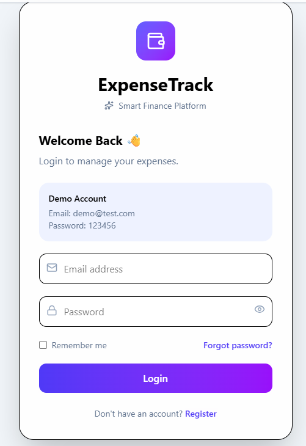
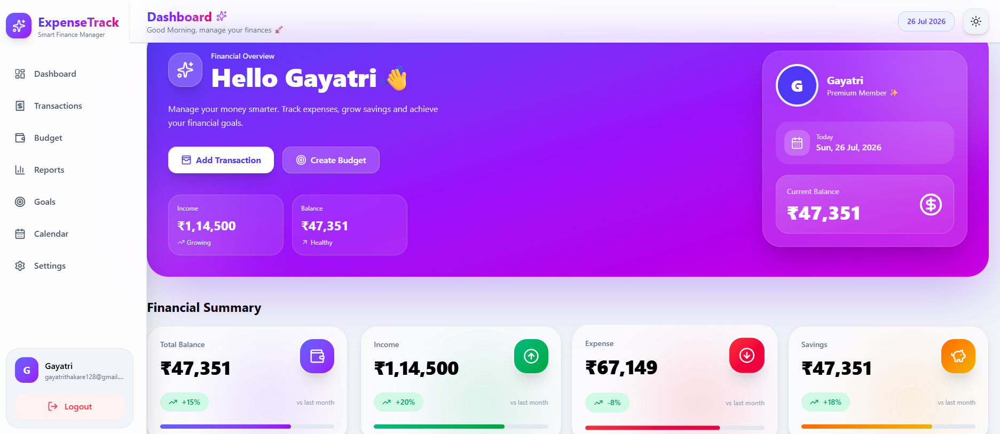
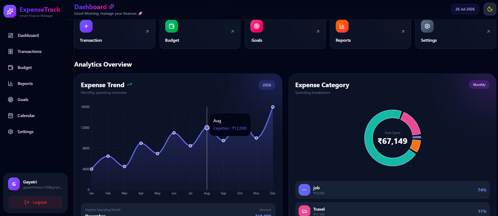
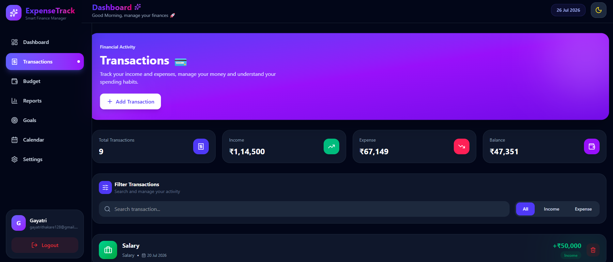
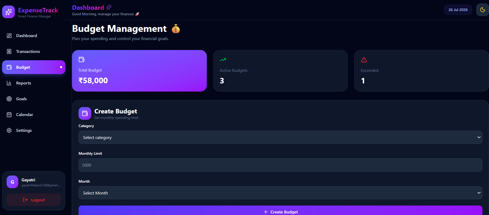
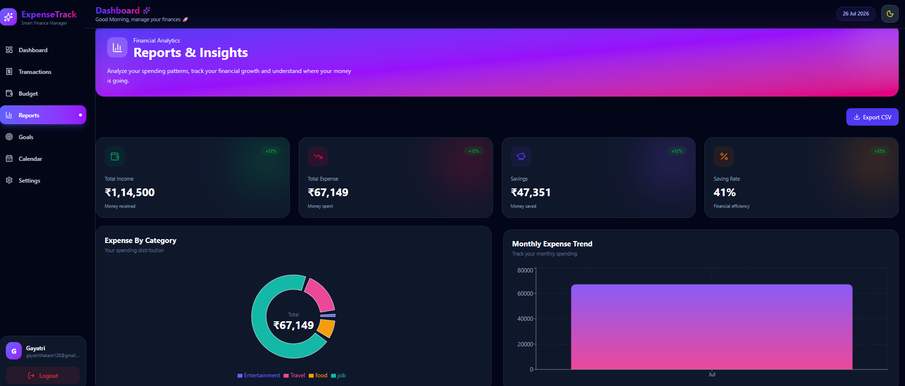
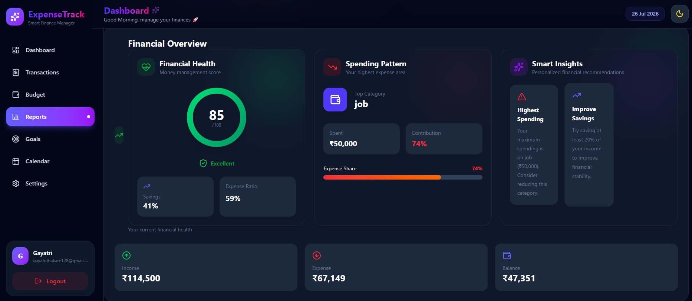
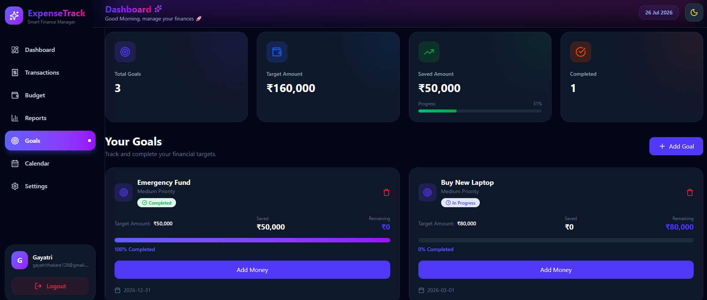
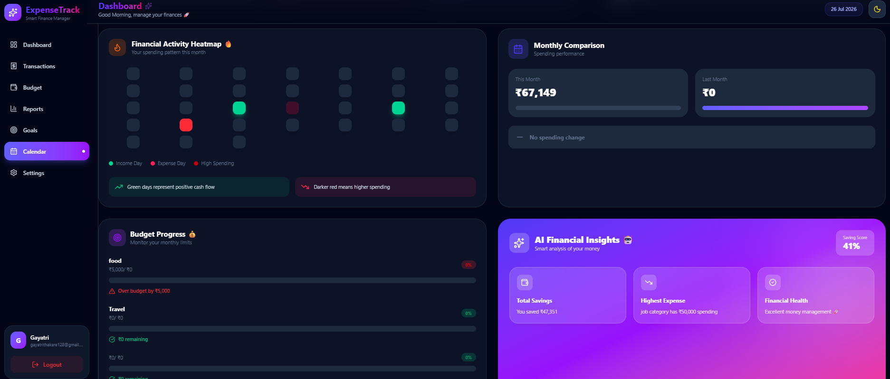
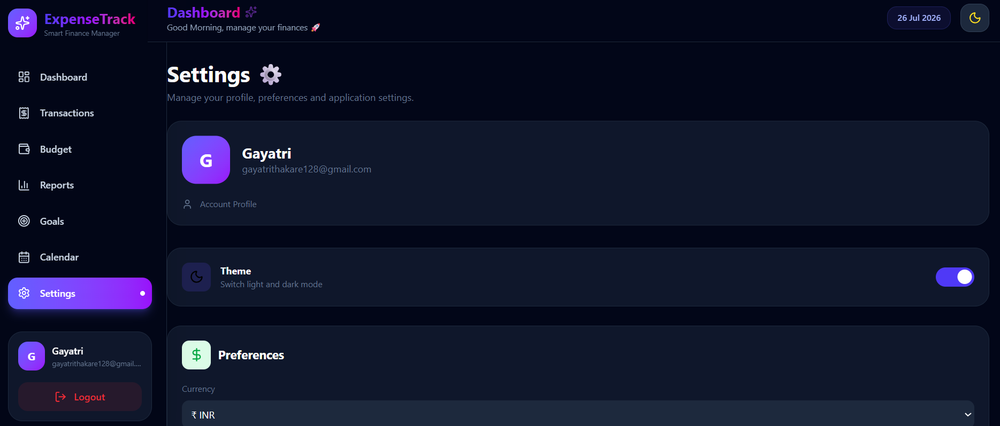

# 💰 FinanceTrack

<p align="center">


</p>


<h1 align="center">

🚀 FinanceTrack

</h1>


<h3 align="center">

Premium Personal Finance Management Dashboard

</h3>


<p align="center">

A modern SaaS-inspired finance management application to track income, expenses, budgets and financial insights with beautiful UI, animations and responsive experience.

</p>


<p align="center">

✨ Built with React.js + Tailwind CSS + Zustand

</p>


<br/>


## 🌐 Live Demo

🚧 Coming Soon


## 📌 Project Overview


FinanceTrack is a premium personal finance dashboard designed to help users manage their financial life easily.

The application provides a complete experience for:

- Tracking daily transactions
- Managing monthly budgets
- Understanding spending patterns
- Monitoring financial health
- Visualizing financial data
- Customizing user preferences


The goal of FinanceTrack is to provide a clean, intuitive and professional SaaS dashboard experience.


---

# ✨ Key Features


## 🔐 Authentication System


- User Registration
- Secure Login Flow
- Protected Routes
- Persistent User Session
- Logout Functionality
- Form Validation
- Password Strength Indicator


---

# 📊 Smart Dashboard


- Premium financial overview
- Dynamic greeting system
- Balance tracking
- Income & expense summary
- Savings calculation
- Animated statistics cards
- Financial health score
- Smart insights


---

# 💳 Transaction Management


- Add income transactions
- Add expense transactions
- Category based tracking
- Recent transaction history
- Dynamic calculations
- Expense analysis


---

# 🎯 Budget Management


- Create monthly budgets
- Track spending limits
- Budget progress visualization
- Overspending detection
- Category based budgeting


---

# 📈 Analytics & Visualization


- Expense charts
- Category distribution
- Spending insights
- Financial trends visualization
- Interactive dashboard analytics


---

# 🎨 Premium UI/UX


- Modern SaaS dashboard design
- Glassmorphism cards
- Gradient UI components
- Dark mode support
- Smooth animations
- Responsive layouts
- Loading splash screen
- Custom toast notifications
- Mobile friendly interface


---

# 🛠 Tech Stack


## Frontend


| Technology | Usage |
|---|---|
| React.js | Component based UI |
| JavaScript ES6+ | Application logic |
| Tailwind CSS | Modern styling |
| Zustand | Global state management |
| React Router DOM | Navigation |
| React Hook Form | Form handling |
| Zod | Validation |
| Framer Motion | Animations |
| Recharts | Data visualization |
| Lucide React | Icons |


---

# 🏗 Application Architecture


```
User Interface

      ↓

React Components

      ↓

Zustand Global Store

      ↓

Utility Functions

      ↓

Local Storage Persistence

```


---

# 📂 Project Structure


```
FinanceTrack

│
├── src
│
├── components
│   │
│   ├── auth
│   │   ├── LoginForm.jsx
│   │   ├── RegisterForm.jsx
│   │   ├── AuthInput.jsx
│   │   └── PasswordStrength.jsx
│   │
│   ├── dashboard
│   │   ├── DashboardHero.jsx
│   │   ├── StatsCard.jsx
│   │   ├── ExpenseChart.jsx
│   │   ├── ExpensePieChart.jsx
│   │   ├── QuickActions.jsx
│   │   ├── FinancialHealth.jsx
│   │   ├── RecentTransactions.jsx
│   │   ├── BudgetOverview.jsx
│   │   └── InsightsCard.jsx
│   │
│   ├── transactions
│   │
│   ├── budget
│   │
│   ├── layout
│   │
│   └── common
│
│
├── pages
│
│   ├── auth
│   │   ├── Login.jsx
│   │   └── Register.jsx
│   │
│   ├── Dashboard.jsx
│   ├── Profile.jsx
│   ├── Settings.jsx
│   └── NotFound.jsx
│
│
├── store
│
│   ├── authStore.js
│   ├── transactionStore.js
│   ├── budgetStore.js
│   ├── themeStore.js
│   └── modalStore.js
│
│
├── routes
│   └── AppRoutes.jsx
│
│
├── utils
│
└── App.jsx

```


---

# 📸 Screenshots

## Login Page


<p align="center">



</p>

## Dashboard


<p align="center">



</p>


## Dashboard Dark Mode


<p align="center">



</p>


## Transacton page


<p align="center">



</p>


## Budget page


<p align="center">



</p>


## Report page


<p align="center">



</p>
<p align="center">



</p>


## Goal page


<p align="center">



</p>


## Calendar page


<p align="center">



</p>


## Settings page


<p align="center">



</p>


---

# 🚀 Getting Started


## Clone Repository


```bash
git clone https://github.com/YOUR_USERNAME/FinanceTrack.git
```


## Install Dependencies


```bash
npm install
```


## Start Development Server


```bash
npm run dev
```


## Production Build


```bash
npm run build
```


---

# 🔑 Demo Account


```
Email:
demo@gmail.com


Password:
123456
```


---

# 🚀 Deployment


FinanceTrack is deployment ready and can be hosted on:


- Vercel
- Netlify


---

# 🔮 Future Roadmap


## Phase 1

✔ Dashboard  
✔ Authentication  
✔ Budget Management  
✔ Analytics  


## Phase 2

- Backend API Integration
- Database Support
- JWT Authentication
- User Profiles


## Phase 3

- AI Spending Assistant
- Financial Recommendations
- Export Reports
- Email Notifications
- Multiple Accounts


---

# 📈 Performance & Quality


✔ Component based architecture

✔ Reusable UI components

✔ Optimized state management

✔ Responsive across devices

✔ Clean folder structure

✔ Modern React practices


---

# 👩‍💻 Author


## Gayatri Thakare


Frontend Developer


### Skills


React.js  
JavaScript  
Tailwind CSS  
Zustand  
Responsive UI Development  
Frontend Architecture


---

# 🤝 Connect


LinkedIn:

https://www.linkedin.com/in/gayatri-thakare-32a9b4378/


GitHub:

https://github.com/GayatriThakare1216


---

# ⭐ Support


If you like this project, consider giving it a ⭐ on GitHub.


<p align="center">

Made with ❤️ using React.js

</p>
